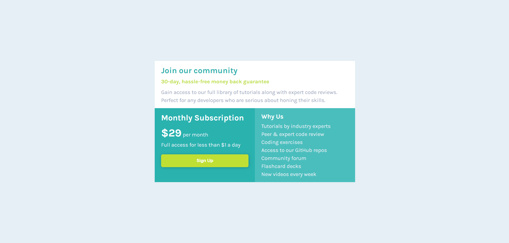

# Frontend Mentor - Single price grid component solution

This is a solution to the [Single price grid component challenge on Frontend Mentor](https://www.frontendmentor.io/challenges/single-price-grid-component-5ce41129d0ff452fec5abbbc). Frontend Mentor challenges help you improve your coding skills by building realistic projects.

## Table of contents

- [Overview](#overview)
  - [The challenge](#the-challenge)
  - [Screenshot](#screenshot)
  - [Links](#links)
- [My process](#my-process)
  - [Built with](#built-with)
  - [What I learned](#what-i-learned)
  - [Continued development](#continued-development)
  - [Useful resources](#useful-resources)
- [Author](#author)

## Overview

### The challenge

Users should be able to:

- View the optimal layout for the component depending on their device's screen size
- See a hover state on desktop for the Sign Up call-to-action

### Screenshot




### Links

- Solution URL: (https://github.com/hassanmoaa/Single-Price-Grid-FrontEndMentor.git)
- Live Site URL: (https://brilliant-treacle-9fe449.netlify.app/)

### Built with

[](https://skillicons.dev)

### What I learned

Practiced my media query skills and responsiveness, also first time to actually put my Grid Skills into practice so it was really wonderful!

```
    display: grid;
    grid-template-columns: 1fr;

@media (min-width: 600px) {

    .grid {
        max-width: 600px;

        grid-template-columns: repeat(2, 1fr);

        grid-template-areas:
        "c c"
        "s f";
    }

    .community {
        grid-area: c;
    }

    .subscription {
        grid-area: s;
    }

    .footer {
        grid-area: f;
    }
}
```

### Continued development

- I want to learn more about css by creating multi-page websites

### Useful resources

- (https://developer.mozilla.org/)
- (https://www.w3schools.com)

## Author

- Frontend Mentor - [@hassanmoaa](https://www.frontendmentor.io/profile/hassanmoaa)
